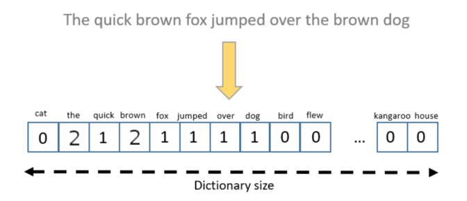

 

# Text Analysis Methods

 

### Douglas Hanley
### University of Pittsburgh
### Spring 2020

---

## Approaches

Constructing metrics for document similarity

---

## Vectorization

The fundamental approach here is to turn textual data into numerical data

Any string of words can be turned into a vector by counting up the number occurances of each word

 <!-- .element class="medium" -->

---

## Words and Phrases

Instead of doing just single words, we can also extend this approach to phrases, which are often called **n-grams**

Popularized by Google's handy Ngram viewer

 <!-- .element class="medium" -->

---

## Normalization

Not all words are created equal, some are more interesting than others
- generally the more rare a word is, the more interesting it is

A common approach here is to downweight words that are more common
\\[ w_k = \log\left(\frac{D}{d_k}\right) \\]
where $d_k$ is the number of documents featuring token $k$ and $D$ is the total number of documents

---

## Long Tail

Common words such as "the", "and", and "of" account for large share of words, with many rare words in the tail

---

## Document Similarity

---

## Document Clustering

---

## Word Embeddings

---

## Machine Learning

GPT-2

---

## Tools

Python

NLTK

sklearn

---

## Jupyter Example

---

## Case Study 1

Wikipedia
- document similarity
- evolution of documents

---

## Wikipedia Results

---

## Case Study 2

Patents to Products
- document clustering
- document categorization

---

## Other Uses

---

## More Resources
