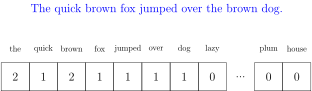
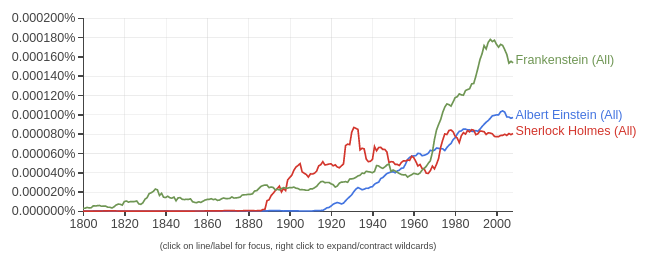
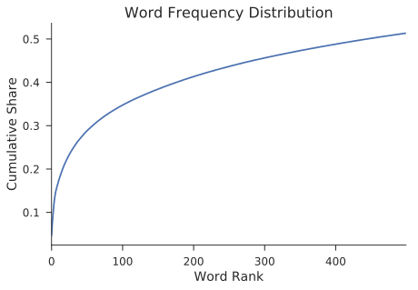
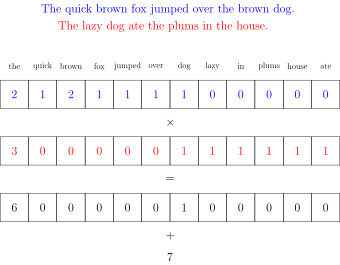
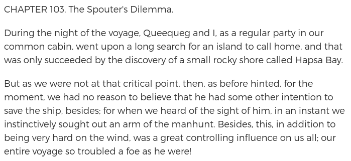
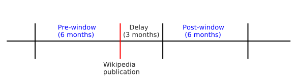

 

# Text Analysis Methods

 

### Douglas Hanley
### University of Pittsburgh
### Spring 2020

---

## Plan for Today

1. Introduction to basic tools of text analysis

2. Live demonstration in Python (Jupyter notebook)

3. Example applications from existing research

---

## Document Vectorization

The fundamental approach here is to turn textual data into numerical data

Any string of words can be turned into a vector by counting up the number occurances of each word

 <!-- .element class="medium" -->

---

## Words and Phrases

Instead of doing just single words, we can also extend this approach to phrases, which are often called **n-grams**, or more generally **tokens**

Popularized by Google's handy [Ngram Viewer](https://books.google.com/ngrams)

 <!-- .element class="large" -->

---

## Long Tail

Common words such as "the", "and", and "of" account for large share of words, with many rare words in the tail

---

## Frequency Normalization

Not all words are created equal, some are more interesting than others
- generally the more rare a word is, the more interesting it is

A common approach here is to upweight words that are less common
\\[ w_k = \frac{1}{f_k} \qquad \text{or} \qquad w_k = \log\left(\frac{1}{f_k}\right) \\]
where $f_k$ is the fraction of documents featuring token $k$

---

## Document Similarity

Once we have vectorized our documents, computing the similarity between them is straightforward

We use a metric called a **cosine similarity** that gives us a number between 0 and 1 representing how similar two vectors are

Mathematically, if we have word vectors $c_1$ and $c_2$, we would calculate the vector product between the two

\\[ \text{Similarity} = \frac{c_1 \cdot c_2}{||c_1|| \cdot ||c_2||} \\]

---

## Similarity Example

 <!-- .element class="medium" -->

---

## Computing Similarity

So we get 7, but what does that mean? We need to divide by some baseline to get it between 0 and 1

Comparing the first (blue) sentence with itself would give 13, while the same for the second (red) sentence is 15, thus the average of 14 seems good
- then we get $7/14 = 0.5$ for out similarity

Does this seem reasonable? The word "the" is doing a lot of work here, that's why we should downweight common words!
- if we do the same thing but ignore "the" and "in", we get $1/7 \approx 0.15$

---

## Document Classification

Instead of comparing pairs of documents, we might want to group them into broad categories

We could just group documents with high similarity together, but it turns out there are better ways
- prime example is known as **k-means clustering**

Choose a number of groups $k$ (say 5) and this will assign each document to groups so that each group is as dense as possible in terms of similarity
- you must give meaning to the groups though (we'll see this)

---

## Machine Learning

With machine learning we can do an even better job of classifying documents, but we need big training sets

This allows you to both classify and go in reverse to generate synthetic documents (see GPT-2 from OpenAI)

 <!-- .element class="medium" -->

---

## Popular Tools

The go to language for text analysis today is Python

Everything we've discussed today can be done using the `sklearn` package

For a more linguistically oriented word-level analysis, `NLTK` is also very useful

---

## Jupyter Example

I'll go through a complete example of using these methods in Python using two sources for documents provided by NLTK
- 20 classic English language novels
- the text of all US presidential inauguration speeches

There is one Jupyter notebook that you can run yourself after downloading it from the [Github repo](https://github.com/iamlemec/text_analysis/blob/master/code/text_analysis.ipynb) for this lecture

Or you can have Binder run it for you by clicking below:

<!-- .element style="width: 300px;" -->

---

## Wikipedia and Science

In my own research, I use document similarity to study the impact of Wikipedia on scientific research

We look at the document similarity between Wikipedia entries and scientific papers before and after publication to see if Wikipedia has some impact
 <!-- .element class="large" -->

---

## Classifying Patents

In another project, we use document clustering to classify US patents into detailed product types (such as laundry detergent or computer keyboards)

---

## Use Cases

Any time you have digitized documents on your hands, these methods can be useful in guiding your analysis
- the largest benefit comes when you have so many documents that manual analysis is infeasible

Particularly promising use cases involve cases where you can link text to other data such as geographical or temporal information

Digitization efforts such as Project Gutenberg have proven very successful and the tools for analysis are getting better and easier to use
